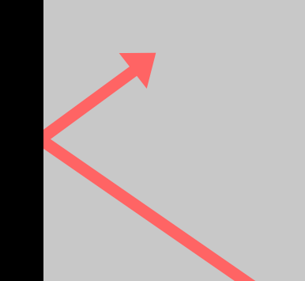

# Pressure Soft Body Physics

## Background
I have followed the implementation provided by Maciej Matyka in this paper to create a 2D physics simulation of a soft body.

The paper provides a minimum implementation of a pressure soft-body model using the C programming language — I have adapted this in Javascript so that it can be accessed online, and I have added a mechanism that allows you to interact with the simulation using a mouse.

I have used the p5.js library to create this project, mainly because it already has ready-made functions to create and manipulate vectors and to visualise the simulation.

## How It Works
As opposed to rigid bodies (where the object's shape is fixed), the shape of soft bodies can deform and change as they interact with other bodies or when a force is applied to them.

In this simulation, the soft body is composed of many points/nodes, which are connected by invisible springs. Each node is connected by two springs (one for each adjacent node).

The image below shows nodes in black and springs in red:

The simulation first calculates and accumulates the forces that are acting on each node. External forces (e.g. gravity) are processed first, followed by the internal forces of the springs. Finally, an internal pressure force is added which inflates the object like a balloon and prevents it from collapsing.

Once all forces have been accumulated, Euler Integration is used to work out the new positions of every node. This is used to update the animation.

## Collision Detection and Handling
To simulate collision detection with the walls, the program regularly checks every node to see whether its position is outside the canvas.

The program checks the x and y position values separately, and if either value goes outside the canvas, the program will invert the relevant component of the node's velocity. For example, if a node's x position value is outside the canvas, the x component of the node's velocity will be inverted. This simulates an effect similar to a laser beam bouncing off a mirror.

I have also used min() and max() functions to constrain each node's position. This ensures that if a node is outside the canvas, it will be moved back within the bounds of the canvas.

**Note:** Checking every node is probably not the best way to implement collision detection, but I've chosen to use this simple implementation. There are other more efficient ways — For example, you could use Spatial Partitioning or other methods to reduce the number of nodes that need to be checked.

## Interact With This Simulation
You can move the soft body by clicking and dragging your mouse pointer across the screen.

You can also modify the properties of the soft body by changing the simulation parameters in the index.html file.

Alternatively, you can interact with simulation online via my website, and change the parameters dynamically: https://www.nathanielbrookes.com/projects/soft-body-physics